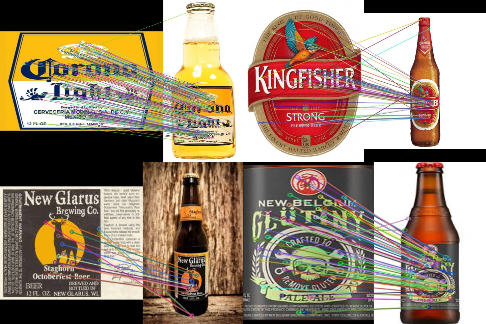
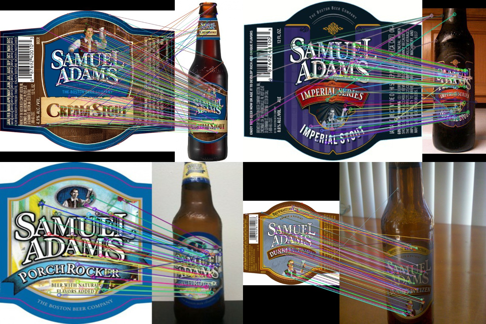
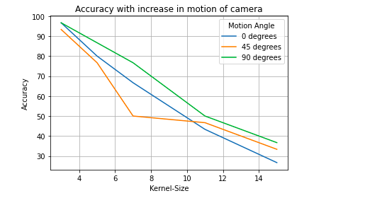
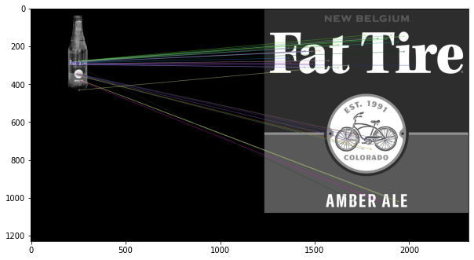

# Beer Label Classification

## Project
The task of this project is to replicate the results from the paper titled [Beer Label Classification for Mobile Applications](https://web.stanford.edu/class/ee368/Project_Spring_1415/Reports/Weitz_Chaudhari.pdf). Here, we attempt to automatically identify  beer  types  using  [SIFT](https://en.wikipedia.org/wiki/Scale-invariant_feature_transform)-based  image matching  of  bottle  labels

## Contents
- [Dataset](#Dataset)
- [Prerequisite](#Prerequisite)
- [Setup](#Setup)
  - [Running the demo](#Running-the-demo)
  - [Running the code](#Running-the-code)
- [Results](#Results)
  - [Visualization](#Visualization)
  - [Effect of Camera Motion](#Effect-of-Camera-Motion)
  - [Effect of Distance](#Effect-of-Distance)

## Dataset
The dataset used for this project is created by scraping and manually downloading the images from Bing and Google.<br>
The dataset directory structure is as follows:
```
images
  ├── database
  ├── query
  ├── samuel_adams
  | ├── database
  | ├── query
```

* The `database` folder consists of images having clean labels.
* The `query` folder contains images of beer bottles with the labels.
* Each query image has a corresponding database image, i.e. each beer bottle has its corresponding clean label image. 
* The primary dataset consist of 100 database and corresponding 100 query images.
* The `samuel_adams` folder consists of 30 database and corresponding 30 query images for the Samuel Adams brewery.

## Prerequisite
Python = 3.6+

## Setup

1. Clone the repo to your local machine (~85 MB). <br>
`git clone https://github.com/Digital-Image-Processing-IIITH/project-dipsum`
2. Move to the project directory.<br>
`cd project-dipsum`
3. Install the required dependencies.<br>
`pip install -r requirements.txt`
4. Create a folder for downloading/saving the descriptor file.<br>
`mkdir lookup`

### Running the demo
Follow the following steps for running a quick demo using a single beer bottle image:<br>
1. Download the pre-computed SIFT descriptors from the given [link](https://drive.google.com/drive/folders/1MpqePCzHbRZHp1CcloUyFzoDXSFT2hkp?usp=sharing) (`main_sift.pkl`, ~69 MB) and save them in the `lookup` folder. <br>
2. Run the following command:<br>
`python src/demo.py -l lookup/main_sift.pkl -q images/query/amstel_light.jpg`
<br>You can use any query image from `images/query/`.

NOTE: This might take approximately 3-5 minutes on your personal laptops.

### Running the code
There are two ways in which you can generate the results for **all** the query images:

1. Execute the end-to-end code `src/main.py`. It will generate the SIFT descriptors for all the images in the `images/database/`. Then it will iteratively generate and match SIFT descriptors of the query images from `images/query/` with the database image's descriptors. For this, run the following command:<br>
`python src/main.py -load N`

2. Download the pre-computed SIFT descriptors from the given [link](https://drive.google.com/drive/folders/1MpqePCzHbRZHp1CcloUyFzoDXSFT2hkp?usp=sharing) (`main_sift.pkl`, ~69 MB) and save them in the `lookup` folder. For this, run the following command:<br>
`python src/main.py`

We also provide an end-to-end script for generating results on the *Samuel Adams* dataset. Similar to `src/main.py`, this can be done in two ways. 

1. Execute the end-to-end code `src/samuel_adams_end2end.py`. For this, run the following command:<br>
`python src/samuel_adams_end2end.py -load N`

2. Download the pre-computed SIFT descriptors from the given [link](https://drive.google.com/drive/folders/1MpqePCzHbRZHp1CcloUyFzoDXSFT2hkp?usp=sharing) (`samadams_sift.pkl`, ~31 MB) and save them in the `lookup` folder. For this, run the following command:<br>
`python src/samuel_adams_end2end.py`

For `src/main.py` and `src/samuel_adams_end2end.py` we provide the following arguments:<br>
`-d`  path to the folder containing database images; <br>
`-q`  path to the folder containing query images; <br>
`-l`  path to the pre-computed descriptors file; <br>
`-load` if Y/y, it will load the precomputed descriptors from the file provided using `-l`, or else, it will run the end-to-end code.

NOTE: Running these scripts might take more than a couple of hours on your personal laptops.

## Results
|Dataset| No. Database Images| No. of Query Images|Accuracy(%)|
|---|---|---|---|
| Primary Dataset| 100| 100| 100 |
|Samuel Adams| 30 | 30 | 100 |

### Visualization
We have provided a python script to visualize the feature mapping using SIFT. <br>
`python src/sift_visualization.py`<br>

It takes two arguments: <br>
`-d` Path to the database image <br>
`-q` Path to the query image <br>

 <br> <br>
 <br>

### Effect of Camera Motion
To study the effect of camera motion, an ipython notebook is provided [CameraMotion.ipynb](src/CameraMotion.ipynb).
Here we study how the camera motion affects the SIFT algorithm. The following graph summarizes the results obtained:<br><br>


### Effect of Distance 
To study the effect of distance of beer bottle from the camera. 
Download the pre-computed SIFT descriptors from the given [link](https://drive.google.com/drive/folders/1MpqePCzHbRZHp1CcloUyFzoDXSFT2hkp?usp=sharing) (`distance_sift.pkl`, ~8.1 MB) and save them in the `lookup` folder.
Run the following command:<br>
`python src/main.py -d images/distances/database/ -q images/distances/query/ -l lookup/distance_sift.pkl`

 <br> <br>

Link to the original project: [https://github.com/Digital-Image-Processing-IIITH/project-dipsum](https://github.com/Digital-Image-Processing-IIITH/project-dipsum)