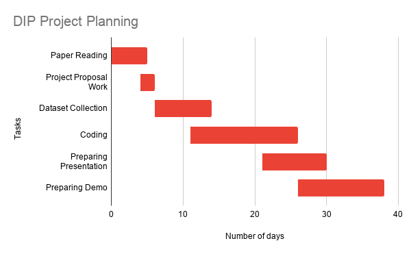

## Project ID and Title

Project ID: 7 
Title: Beer Label Recognition and Classification for Mobile Applications

## Github Link

https://github.com/Digital-Image-Processing-IIITH/project-dipsum

## Team Members 

Madhav Agarwal (2020900022) 
Siddhant Bansal (2019900091) 
Garima Nishad (2019701029) 
Mundru Yallamanda Rao (2019201029)

## Main goal(s) of the project

The goal of this study is to evaluate the feasibility and robustness of an automated image processing technique to enable rapid image-based lookups of various beer labels. 
Such an algorithm would use an input image of a beer bottle and compare the label to a database of beer labels in order to find a match. 
The scope of this project is to develop and characterize the algorithm on a computer first.

## Problem definition (What is the problem? How things will be done ?)

The main problems associated with this task are challenges that are faced in image search in general i.e., searching images irrespective of angle, disposition in the input image.
In this project we choose to implement SIFT to address the issues with respect to the image search.

SIFT extracts distinctive invariant features from images that can be used to perform reliable matching between different views of an object or scene. 
The features are invariant to image scale and rotation, and are shown to provide robust matching across a substantial range of affine distortion, change in 3D viewpoint, addition of noise, and change in illumination. 
In SIFT, keypoints are identified  initially, a descriptor is computed for each of them. 
To create a descriptor that is robust to illumination changes and affine distortions.

## Results of the project (What will be done? What is the expected final result ?)
We will develop an algorithm to classify images of beer labels and hence identify the type of beer. 
Our algorithm will try to find the closest match of the beer type from the dataset. 
We expect to achieve good results with minimum time and computation requirements. 
The expected classification accuracy would be above 95%.

## Project Milestones and Expected Timeline

## Is there a dataset you need? How do you plan to get it?

Yes, we need a dataset. 
To generate our initial database of beer labels, we plan to collect 100 “clean” images (i.e. not photographs) of various beer labels using Google Image search. 
The database will include a variety of breweries, with no more than 5 labels coming from the same one. 
Next, for each database image, a corresponding query (test) image of a beer bottle with that label will be found. 
These test images will possibly include photographs taken 6 to 12 inches away from the bottle, so that the bottle takes up at least a third of the photo.

## References
- Distinctive Image Features from Scale-Invariant Keypoints (https://www.cs.ubc.ca/~lowe/papers/ijcv04.pdf)
- Beer Label Classification for Mobile Applications : (https://web.stanford.edu/class/ee368/Project_Spring_1415/Reports/Weitz_Chaudhari.pdf)
